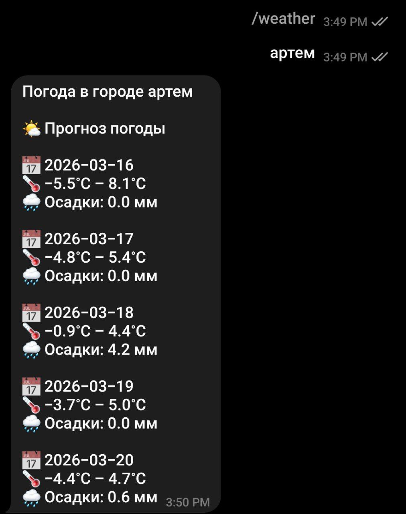
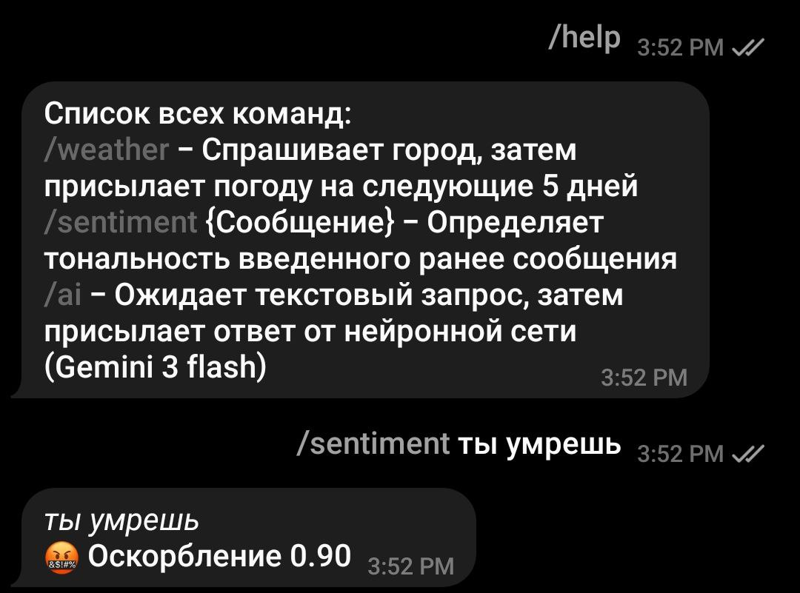

# skywhyAI
## Telegram Bot: Погода • Токсичность • AI-ассистент

> Многофункциональный Telegram-бот с интеграцией внешних API и AI-анализом текста


---

## 📌 О проекте

Этот Telegram-бот предоставляет три основные функции:

1. **🌤 Погода** — получение актуальной погоды в любом городе мира через Open-Meteo API
2. **⚠️ Анализ токсичности** — проверка текста на наличие оскорблений, угроз и опасного контента с помощью модели `cointegrated/rubert-tiny-toxicity`
3. **🤖 Ответ нейронной сети** — Общение с нейронной сетью Google Gemini 3 flash

Бот написан на Python с использованием библиотеки `aiogram` и поддерживает интуитивное меню с навигацией.

---

## ✨ Возможности

| Функция | Описание |
|---------|----------|
| 🌤 Погода | Поиск города через AI, получение температуры, ветра и направления |
| ⚠️ Токсичность | Мультилейбл-классификация: оскорбления, нецензурное, угрозы, опасный контент |
| 🤖 Ответ нейронной сети | Ответ нейронной сети на сообщения пользователя |

---

## 🚀 Установка

### 1. Клонируйте репозиторий

```bash
git clone https://github.com/theaidarmaps/skywhyAI.git
cd skywhyAI
```

### 2. Установите зависимости

```bash
pip install aiogram google-genai transformers torch geopy transliterate
```

### 3. Настройте бота

1. Создайте бота через [@BotFather](https://t.me/BotFather) в Telegram
2. Получите токен и вставьте его в код:

```python
bot = aiogram.Bot(token=TOKEN, default=DefaultBotProperties(parse_mode=ParseMode.HTML))
```

---

## ⚙️ Настройка

### Переменные окружения

Для безопасного хранения токена рекомендуется использовать `.env` файл:

```env
TOKEN=Ваш_API_токен
```

Подключите его через `python-dotenv`:

```bash
pip install python-dotenv
```

---

## Использование

### Команды бота

| Команда | Описание |
|---------|----------|
| `/start` | Запуск бота, отображение главного меню |
| `/help` | Просмотр лоступных команд |
| `/weather` | Переход в режим ввода города |
| `/sentiment` | Переход в режим анализа текста |
| `/ai` | Переход в режим нейронной сети |

---

## 📸 Скриншоты

### Погода


### Анализ токсичности


---

## 🌐 API источники

| Сервис | Назначение | Документация |
|--------|------------|--------------|
| [Open-Meteo Weather](https://open-meteo.com/) | Получение погодных данных | [Документация](https://open-meteo.com/en/docs/forecast-api) |
| [Hugging Face](https://huggingface.co/cointegrated/rubert-tiny-toxicity) | Модель анализа токсичности | [Модель](https://huggingface.co/cointegrated/rubert-tiny-toxicity) |
